<!--
OWNER NOTES (delete this comment before publishing; see NOTES.md for the checklist):
- Images use relative paths (img/...) so the article renders in the repository.
  dev.to needs absolute URLs: run the sed line in NOTES.md, which rewrites
  "](img/" to "](https://raw.githubusercontent.com/jchable/okf4net/<BRANCH>/docs/outreach/articles/okf-viewer/img/".
  <BRANCH> must be a branch or tag that holds these files (main once merged).
- The docs page https://jchable.github.io/okf4net/docs/viewer/ only goes live
  once the website is deployed from main (pages.yml). Check it loads before publishing.
- "On the dev branch today" is true only once PR #176 is merged into dev.
-->

An [Open Knowledge Format](https://github.com/GoogleCloudPlatform/knowledge-catalog/blob/main/okf/SPEC.md) bundle is a directory of markdown files with YAML frontmatter. That is what makes it good for agents and for code review: an agent reads it with `cat`, a reviewer reads a change as a plain diff, and git does the rest. It is also what makes it tedious for a person to browse. Open the folder and you see file names; open a file and you see one concept, with no idea what links to it.

[OKF4net](https://github.com/jchable/okf4net), our independent .NET implementation of the OKF spec, ships a site generator, `okf-render`, for that person. Until now it wrote a plain static site. On the dev branch today, it writes an interactive viewer. Here is a tour, then how it is built and tested.

**TL;DR**

- `okf-render <bundle> --out <dir>` writes a folder of static files. Open `index.html` from disk: no server, no network, nothing to install in the browser.
- Concept pages get a tree explorer with trust and staleness marks read from each concept's frontmatter; every page gets a *Jump to* palette (<kbd>Ctrl</kbd>+<kbd>K</kbd> or <kbd>/</kbd>) and a light/dark theme.
- Each concept page draws its **Neighbourhood**, the concepts it links to and that link to it, and a separate page draws the **whole bundle's link graph** with facets, a detail drawer and shareable `graph.html#<concept id>` addresses.
- Every drawing has a text equivalent and a keyboard path. The graph is one tab stop; the arrow keys walk from a node to its neighbours.
- Under the hood: no new runtime dependency, a graph layout that gives the same positions in Chromium, Firefox and WebKit, a DOM sanitizer as the whole defence against hostile markdown, and a test harness that runs the real scripts.

## The problem: easy to diff, hard to browse

OKF is Google's open format for knowledge that both people and agents read. A **bundle** is a directory tree of markdown files. Each file is a **concept**: a YAML frontmatter block (`type` is the only required field; `title`, `description`, `tags`, `status` and others are common) and a markdown body. A concept's id is its path without `.md`, and concepts link to each other with ordinary markdown links. The spec also defines provenance and trust fields: `verified` records who reviewed a concept and when (§5.2), and `stale_after` says when it should be looked at again (§5.5).

OKF4net implements v0.2 on the .NET base class library alone (its own YAML-subset parser and link scanner, no third-party packages), built from the spec rather than ported from another implementation. Besides the library it ships two Native AOT tools: `okf`, which validates, audits and formats bundles, and `okf-render`, which turns one into a website.

Here is what `okf-render` 0.6.0 produced for a concept of `acme_retail`, the sample bundle in the repository:

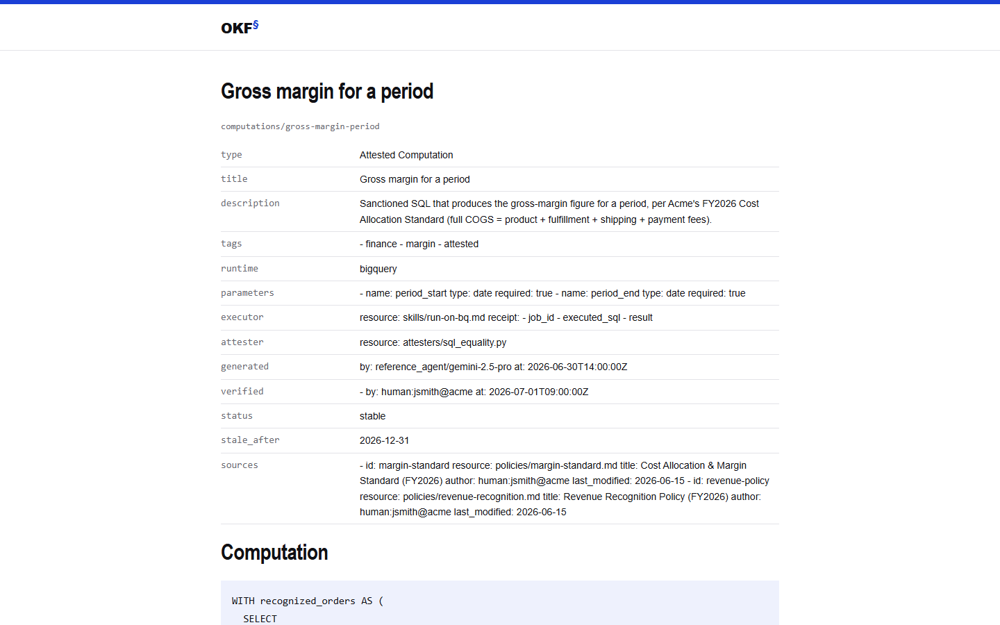

One page per concept, the frontmatter as a table, the body rendered, links that work, and an index page. It was correct, and it answered none of the questions you have while reading: where am I in the bundle, what else is there, who points at this, and can I trust it.

> **In short:** an OKF bundle is easy for agents and diffs, hard for people to browse. `okf-render` used to write one flat page per concept; the new version turns those pages into a viewer.

## One command, a folder of files

The command is the same as before:

```sh
okf-render bundles/acme_retail --out ./acme-site
# then open ./acme-site/index.html in any browser: double-click it
```

What it writes is still a folder of plain files: `index.html`, one page per concept at the concept's own path (`computations/gross-margin-period.html`), a graph page for the whole bundle, and an `assets/` folder with the stylesheet, the scripts, the fonts with their licences, and one generated data file, `okf-index.js`. The graph page is `graph.html` in the usual case, and the rest of this article calls it that; if a concept already owns that name (a root-level `graph.md`, say), `okf-render` picks `graph-1.html`, then `graph-2.html`, and so on, and the header link follows. Nothing is fetched from the network when a page opens, so the folder works from `file://`, from a USB stick or from any static host. `okf-render` itself is a self-contained Native AOT binary: the machine that renders needs no .NET runtime.

It is deliberately a separate binary from `okf`, the small validator that runs in CI, so that `okf` does not carry what only a website needs: a vendored copy of [marked](https://github.com/markedjs/marked) to render markdown in the browser, and three embedded font families.

**Getting it today.** The interactive viewer is not in a release yet. Until the next release of `okf-render`, build it from a checkout of the dev branch (it needs the .NET SDK 10.0 or later):

```sh
git clone https://github.com/jchable/okf4net && cd okf4net
git switch dev
dotnet publish src/OKF4net.Render -c Release   # self-contained Native AOT binary
```

Native AOT also needs the platform's native toolchain; if you only want to try it, the `dotnet run` command at the end of this post skips that step.

Once that release is out, each [GitHub Release](https://github.com/jchable/okf4net/releases) carries prebuilt `okf-render` archives for Windows, Linux and macOS, and on Linux and macOS the install script fetches and checks the right one when you pass `--bin okf-render`. Its winget package has not been submitted yet, so do not look for it there.

> **In short:** one command, one folder, `index.html` opened from disk. Build it from the dev branch today; prebuilt archives come with the next release.

## A guided tour

All the captures below are of `acme_retail` (nine concepts) or of a synthetic bundle of 112 concepts that the screenshot script generates, with fictional names, to show what nine concepts cannot.

### The concept page


Concept pages and the index share one header: the bundle's name with its concept and link counts, the *Jump to a concept…* button, *Filters*, *Global graph* and the theme toggle (the graph page has the same header, with *Reading view* in place of *Filters*). Below it, three columns from 1,100 px of window width up:

- **On the left, the explorer**, described below.
- **In the middle, the concept.** A breadcrumb, the title, and chips for the type, the `status`, the trust tier with who verified the concept and when, and its staleness. The frontmatter box shows four entries the chips do not already show, with *Show all* for the rest. Then the body, rendered in the browser through a sanitizer (more on that below), with broken links flagged and heading anchors that make an author's own `#usage` links land.
- **On the right, the context.** *On this page* lists the headings and marks the one you are reading, *Neighbourhood* draws the concept's links, and *Referenced by* lists the concepts that link to this one.

### The explorer

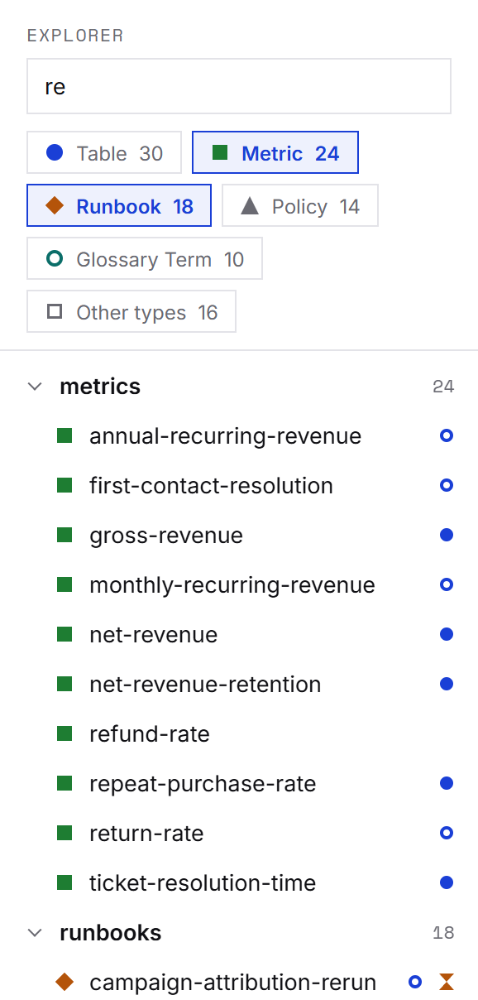

The explorer lists the bundle the way its directories do. A concept that is also a folder (`foo.md` beside `foo/`) can be opened and expanded separately. Rows show the last segment of the id, with the title as a tooltip.

**Types are shapes, not only colours.** The types are ranked by how many concepts carry them. The five most frequent get a circle, a square, a diamond, a triangle and a ring, each with its own colour; every further type shares a sixth shape. The same shape stands for the type in the explorer, the palette, the chips, the lists and both graphs. The type chips filter the tree: press several to show any of them, then narrow by name.

**Trust and staleness come from the concept's own frontmatter.** A filled dot marks a *human-reviewed* concept: its `verified` field (§5.2) holds at least one stamp by a `human:<id>` actor. A ring marks a *machine-confirmed* one: stamps, none by a human. No `verified` key, no mark. The tiers come from the same audit code `okf audit` runs. An hourglass marks a concept past its `stale_after` date, judged **as of reading**: the page compares it with your browser's clock when it opens and when the tab comes back to the foreground, so a site rendered in March can show a concept as stale in June.

A trust mark is a declaration, not a proof: it shows who a concept *says* reviewed it. The spec calls these tiers advisory signals, not access control.

### Jump to a concept

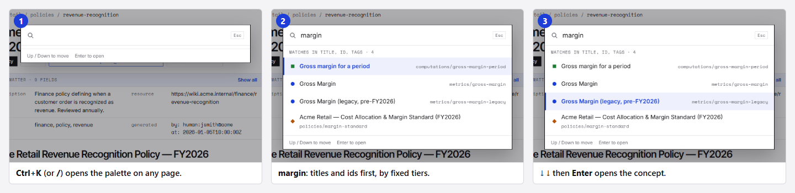

Press <kbd>Ctrl</kbd>+<kbd>K</kbd> or <kbd>/</kbd> on any page, or click the button, and type. The palette matches what you type against concept **titles, ids and tags**, using fixed tiers tried best first: an exact id, then a prefix of the title or id, then a substring of either, then an exact tag. Ties keep the bundle's order. There are no weights, and it never reads a concept's body.

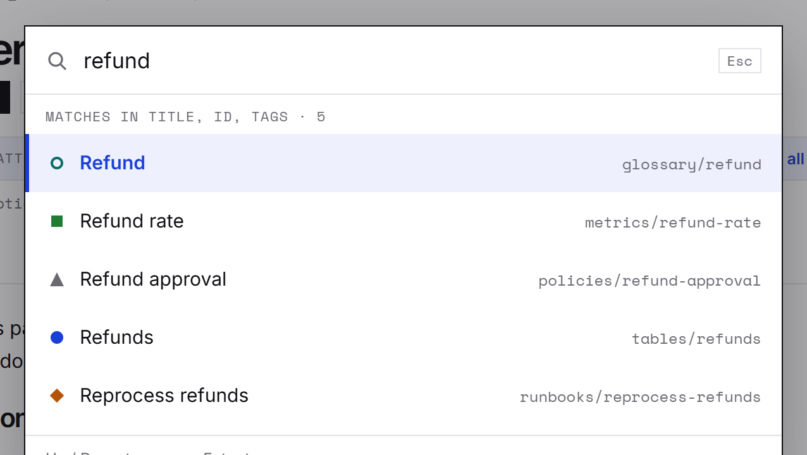

**Why there is no full-text search.** OKF4net has exactly one full-text scorer, `ConceptSearch`, in the .NET library, shared by the agent tools and the catalog so that "search" means one thing everywhere. A static site has no process to run it in, and copying its weights into JavaScript would create a second scorer that drifts from the first. So the palette navigates; it does not search. Body search exists today through the library and the `okf-mcp` server, and interactive browsing with search is planned as a VS Code extension ([#163](https://github.com/jchable/okf4net/issues/163)). There is no `okf serve`, and none is planned.

### The Neighbourhood

A concept page whose concept has neighbours (links out or links in) gets a *Neighbourhood* section: the concept in the middle, its neighbours around it in rings, at **1 hop** or, with the button, **2 hops**; the legend reads *solid = links to, dashed = referenced by*. A link to a concept that does not exist is drawn as a ghost that never navigates. *Open in graph* opens the global graph on this concept.

The panel draws **at most 40 nodes**, the concept included, direct neighbours first, and says *+N omitted* beyond. At the cap it is crowded. Here is the hub of the synthetic bundle, a glossary term with 61 neighbours:

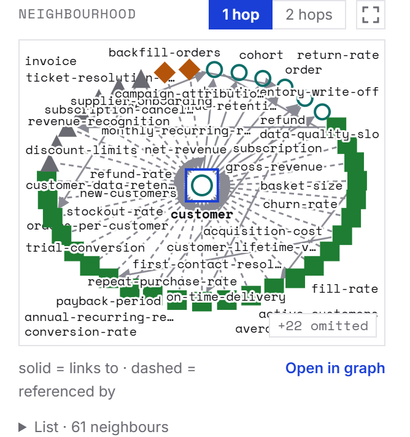

Two things make it usable anyway. Under the drawing, *List* gives **every** neighbour, drawn or not, with its relation to the concept (links to, referenced by, or two hops via which neighbour). And *Enlarge the neighbourhood*, the icon beside the hop toggle, opens the same graph in a dialog of up to 1,100 × 760 px, with the list beside it:

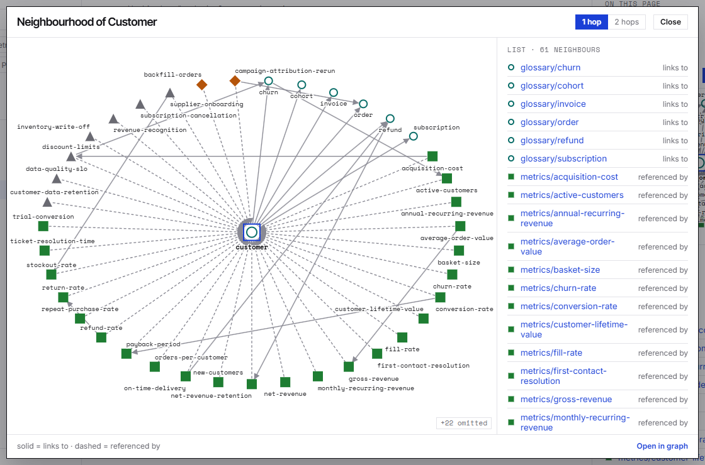

Shapes and text keep their size; the rings spread out, and in a drawing this wide labels are cut at 32 characters instead of 20.

### The global graph

*Global graph* in the header opens `graph.html`, which draws every body link of the bundle, the same edge set `okf graph` exports, with arrows pointing at the target.


- **Facets** narrow what is drawn: type, trust, freshness (*Stale only, as of now*) and tags, *and* between facets, *or* inside one. Unmatched concepts are hidden or, as here, dimmed.
- **The drawing** pans, zooms and lets you drag a node; *Fit* frames everything drawn.
- **The drawer** shows the selected concept: chips, description, what it links to, what references it, and *Open page*.
- **Addresses.** Selecting a concept writes `graph.html#<concept id>` to the address bar without adding a history entry, and opening such an address selects it, so you can paste it into a chat. A concept page's *Global graph* link uses it to land on that concept.

The layout is a force simulation computed in your browser. Here it is on the 112 concepts of the synthetic bundle:

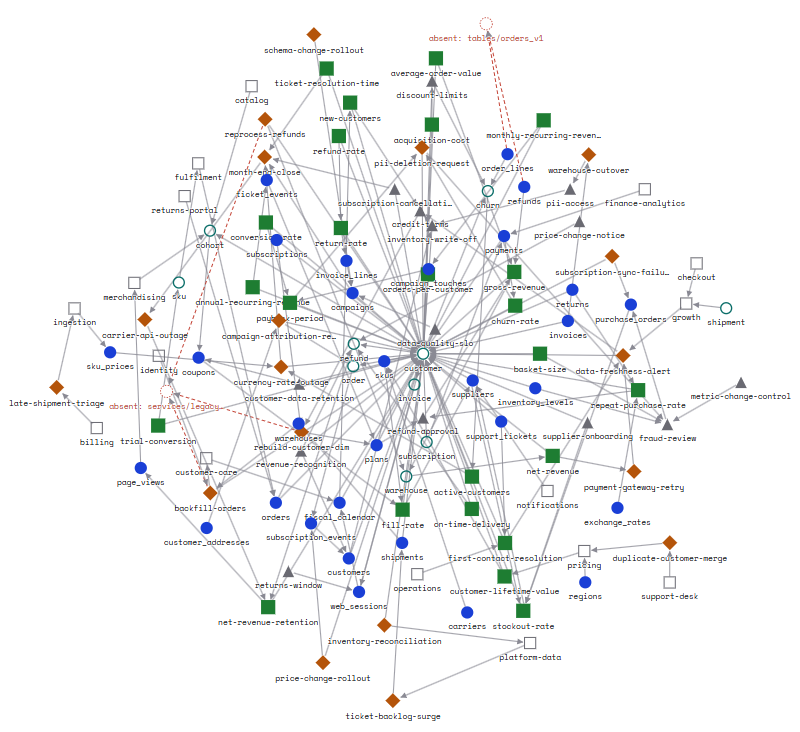

Above 1,500 visible nodes (concepts and absent targets), the page does not draw at all: it shows the list and asks for narrower filters.

### The side column, the theme and small screens

The right-hand column (the context panel, or the graph's drawer) has a splitter. Drag it with a mouse, a finger or a pen, or focus it and use the arrow keys (16 px a step, 64 with <kbd>Shift</kbd>, <kbd>Enter</kbd> to reset). The width stays between 240 and 720 px, never leaving the middle column less than 360, and is remembered in the browser's local storage. The global graph refits to its new canvas unless you have moved the view yourself.

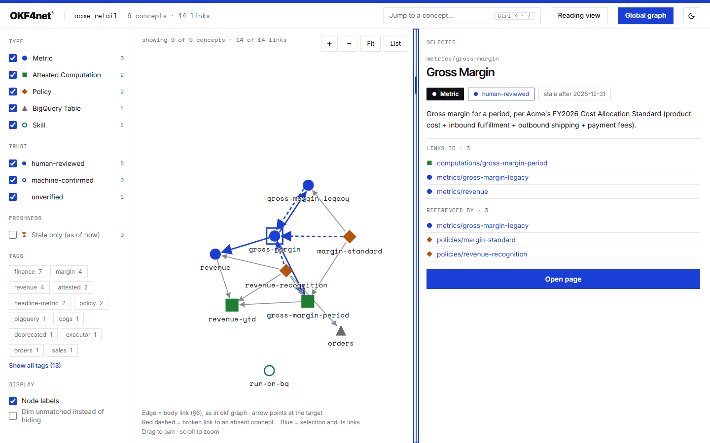

The pages follow your system's light or dark setting; the moon button overrides it and remembers the choice where the browser allows storage.

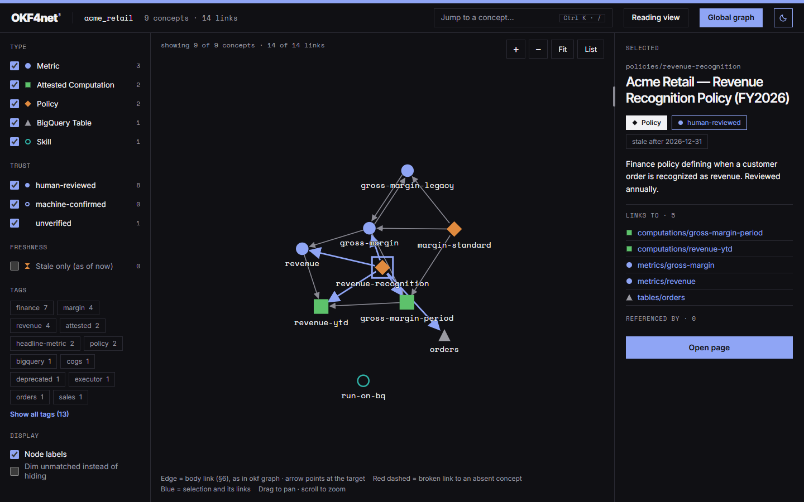

Below 1,100 px the columns stack (the page first, then its context, then the explorer), and on a phone the header wraps:

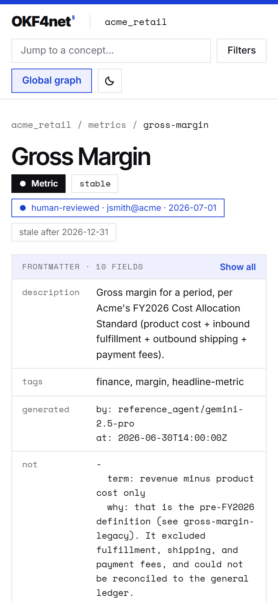

> **In short:** an explorer with type shapes and trust marks, a palette that jumps by title, id or tag, a Neighbourhood per concept with a dialog when it gets crowded, a global graph with facets, a drawer and shareable addresses, and a layout that holds from a phone to a wide screen.

## Accessibility and the keyboard

We treated "a graph is a picture" as the main accessibility risk and designed around it.

**One tab stop, then the arrows.** The global graph's drawing is a single tab stop. Inside it, <kbd>Page Up</kbd> and <kbd>Page Down</kbd> walk the nodes in the bundle's order, so an isolated node or a separate component is always reachable; <kbd>Home</kbd> and <kbd>End</kbd> go to the first and the last; an arrow key goes to the nearest neighbour in that direction; <kbd>Space</kbd> selects and <kbd>Enter</kbd> opens the concept's page. The selected node carries `aria-current`.


**A text equivalent for every drawing.** The Neighbourhood has its *List*. The global graph has its *List*, which replaces the drawing in place and honours the same facets, plus the detail drawer:

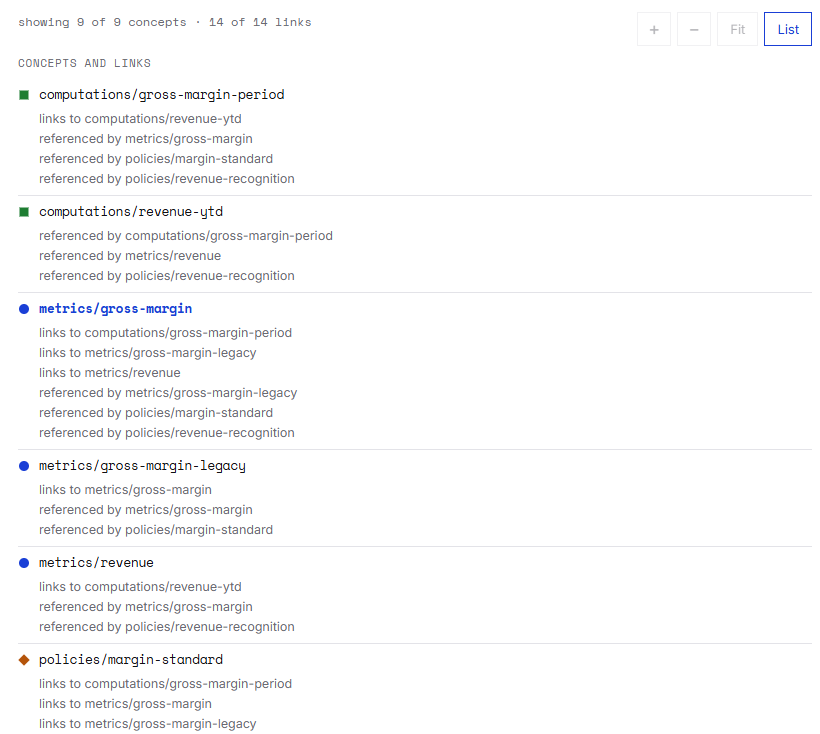

**Focus is handled in dialogs.** The palette is a modal dialog: focus goes to its field, stays inside, and returns to where it was on <kbd>Esc</kbd>. In the enlarged Neighbourhood, <kbd>Tab</kbd> wraps round the dialog's own controls, the page behind is inert and does not scroll, and <kbd>Esc</kbd>, *Close* or a click on the backdrop return the focus to the button that opened it.

**Never colour alone.** Types differ by shape and colour, trust by a filled dot or a ring. Text targets 4.5:1 contrast and shapes 3:1, in both themes, measured in real browsers. Under reduced motion, the graph's layout still runs, but only its start and end are drawn.

What we have not done yet: manual checks with an input method editor and with a screen reader. They are tracked in [#177](https://github.com/jchable/okf4net/issues/177).

> **In short:** one tab stop and arrow-key navigation in the graph, a list for every drawing, real focus management in both dialogs, shapes as well as colours. IME and screen-reader checks are still to do.

## Under the hood

This part is for the engineers.

### What "zero dependency" means here

OKF4net allows no third-party runtime dependency per project, and `OKF4net.Viewer`, the library behind `okf-render`, references only the core library. There is no npm package and no bundler: the browser scripts are plain files embedded in the .NET assembly. Two things are vendored, as named exceptions: [marked](https://github.com/markedjs/marked) v15.0.12 (MIT), and the Inter, Inter Tight and Space Mono fonts (SIL OFL 1.1). Their licence texts are written into every generated site and ship beside the binary. `okf` never references any of it.

### One generated data file, classic scripts

The interactive parts need the whole bundle on every page: the tree, every concept's title, type, tags, trust tier and deadline, every edge. `okf-render` writes it once as `assets/okf-index.js`, a script that sets `window.OKF_INDEX`, because a `fetch` of a local JSON file is blocked under `file://`. For the same reason the scripts are classic scripts, not ES modules: each one is wrapped in its own function, exposes one global, and does nothing if what it needs is missing, which also lets the Node test harness load each one exactly as a page does.

Bundle text is untrusted and ends up in a JavaScript file, so every string from the bundle goes through one C# quoting function that writes a JSON string literal and also escapes `<`, `>`, `&`, U+2028 and U+2029. The index holds only arrays and fixed-key records, never an object keyed by concept id: `__proto__`, `constructor` and `toString` are valid concept ids, and an object literal keyed by one of them does not mean what `JSON.parse` of the same text means. Measured during development on OKF4net's own generated bundle (795 concepts, 912 edges), the file was 407,325 bytes.

### A layout that is the same everywhere

A force layout usually starts from random positions and runs until it looks settled, so two people opening the same bundle see two different pictures. We wanted the same picture, so the simulation, `okf-sim.js`, is a pure module with constraints written at its top:

- no DOM, no clock, no `Math.random`;
- only `+ - * / % >>>`, `Math.sqrt` (whose rounding ECMAScript fixes) and the exact `Math.floor`, `ceil`, `trunc`, `abs`, `min`, `max` and `imul`; never `sin`, `cos`, `exp`, `pow` or `**`, whose results the standard lets each engine approximate;
- a fixed order for every accumulation;
- work **counted, never timed**, spread over animation frames: a frame may stop mid-iteration, but positions only change when an iteration completes, so the state after *k* iterations does not depend on the slicing.

The starting positions are a grid in index order, jittered by an integer generator seeded from the node and edge counts:

```js
// 32-bit linear congruential generator on an integer state: exact.
function nextState(state) {
  return (Math.imul(state, 1664525) + 1013904223) >>> 0;
}
// ... in initialLayout(n, edgeCount):
var state = (Math.imul(n, 73856093) + Math.imul(edgeCount + 1, 19349663)) >>> 0;
```

Labels are part of the layout: each node gives the box its shape and label cover, with the label width *estimated* from its length rather than measured, because measured text differs between browsers and would make the layout differ too. The result: the same positions, bit for bit, in Chromium, Firefox and WebKit, checked on `acme_retail`, on the harness fixture, on OKF4net's own bundle and on a synthetic bundle of 1,414 nodes.

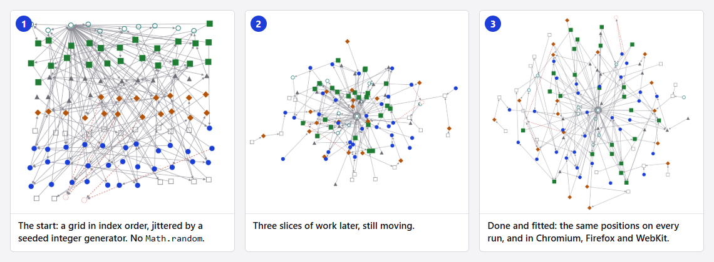

### The sanitizer is the whole defence

A bundle's markdown is untrusted input. `marked` turns it into HTML in the browser, and `viewer.js` then sanitizes the **parsed DOM**: an element allowlist, a per-tag attribute allowlist that drops every `on*` handler, URL-scheme checks on `href` and `src`, and opaque elements (`<script>`, `<style>`, `<iframe>` and a few more) removed with their content. Other unknown elements, such as `<details>`, are unwrapped: the element goes, its sanitized children stay.

An earlier version also patched marked's renderer hooks to drop raw HTML. Measured against the harness's hostile payloads, it stopped nothing the DOM sanitizer did not already stop, and it deleted benign content: a `<details>` block with a summary and some text came out empty. It also could not see the case the DOM sanitizer exists for: marked's `Renderer.image()` writes the `alt` attribute without escaping it, so a plain markdown image, ``, with no raw HTML anywhere, breaks out of the attribute. Only a defence that looks at the resulting DOM catches that, so the hooks were removed.

### The `class` attribute problem

The sanitizer keeps `class` in one place only: on `<code>`, where marked writes a fenced block's `language-…` class. But it means a concept body can contain `<code class="okf-chip">`, wearing the viewer's own class names. If the stylesheet styled `.okf-chip` wherever it appears, a hostile concept could draw a fake *human-reviewed* badge, hide text from sighted readers, or lay an overlay that looks like a dialog.

So every rule for the viewer's own interface, its *chrome*, is **anchored** to a container body content cannot produce, such as `#okf-explorer` or `body > header.bar` (the sanitizer strips `id` from the body), and every script lookup starts from a fixed element id or an anchored selector, with any descendant query by class kept inside that root, so a class name worn by body content is never searched for from the whole document. The harness enforces it in three layers, none claimed as a proof on its own: a static scan of every selector in the stylesheet; a selector-matching comparison between a body element wearing each chrome class and its unclassed twin; and a comparison of their computed styles. Each delivery slice adds a fixture page listing its chrome classes, so new chrome is covered as soon as it exists.

### Testing code that xunit cannot run

The .NET test suite cannot execute JavaScript, and a test that greps a `.js` file for a marker string stays green when the code behind the marker is gutted. So the guarantees live elsewhere:

- **A jsdom harness** (`tools/viewer-security-check/`) loads the real `marked.min.js` and every viewer script into a site generated by the real `okf-render` from a **hostile fixture bundle**: titles containing HTML, concepts named `__proto__`, `constructor` and `toString`, broken links, clobbering attempts, body code wearing chrome classes. It drives the layout through an injected scheduler, so its checks are deterministic. It runs in CI as the `viewer sanitizer (JS)` job, with 453 cases at the time of writing.
- **Mutation checks.** For the newest parts, deliberate bugs were planted in the scripts to check that a case fails for each: the splitter's cases killed 50 such mutants, the enlarged dialog's 30.
- **A tooled recette in real browsers**, run by hand: it opens the generated sites from `file://` in Chrome, Edge, Firefox and WebKit and measures what jsdom cannot see, such as fonts actually loaded, contrast in both themes, layout at three widths, and that no request leaves the site. Playwright is resolved at run time, never a dependency.
- **A Native AOT smoke test in CI** publishes the native `okf-render` on Linux, macOS and Windows, renders a bundle, checks the output, and executes the `okf-index.js` the native binary wrote.

### The honest limits

- **The 40-node cap is crowded at the cap.** On a hub, some labels sit far from their node and the edges converge on the centre. The dialog and the list are the answer, not the panel drawing.
- **Big graphs.** Above 1,500 visible nodes the global graph shows a list instead of a drawing. The palette scans every concept on each keystroke, which very large bundles will feel.
- **Not checked by hand yet:** input method editors and screen readers (#177), and Safari: the recette runs WebKit, which is not Safari.
- **No full-text search**, by design (see above), and **no live reload**: the site is a snapshot, so render again after the bundle changes.

> **In short:** no new runtime dependency, one generated index, classic scripts for `file://`, a layout made deterministic by construction, a DOM sanitizer that does the whole job, anchored chrome selectors, and tests that run the real JavaScript. The limits are listed rather than hidden.

## How it was built

The viewer was specified before it was written: a design document in the repository (`docs/superpowers/specs/2026-10-06-okf-viewer-interactive-design.md`, fifteen revisions) with validated mockups and the owner's decisions. It was delivered in slices on one branch (navigation, fidelity to the mockups, the local graph, the global graph, then the splitter and the enlarged dialog), each with its own plan, harness cases and browser recette. It was reviewed task by task and checked in real browsers, not only by the harness.

Those browser checks earned their place, because jsdom does no layout. Labels overlapped on the first open of the global graph, which is why the simulation now lays out boxes, not points. A CSS rule pushed the selected list entry a screen below the fold, in Firefox only. The graph page held the main thread too long near the node limit until its drawing was spread over frames.

> **In short:** a written spec, small slices, and a browser in the loop for every slice.

## Try it, and where to help

```sh
git clone https://github.com/jchable/okf4net && cd okf4net && git switch dev
dotnet run -c Release --project src/OKF4net.Render -- bundles/acme_retail --out ./acme-site
# open ./acme-site/index.html
```

Then point it at your own bundle. If you do not have one, `okf` can validate one you write by hand, and the [getting-started guide](https://jchable.github.io/okf4net/docs/getting-started/) walks through it.

OKF4net is a small project and contributions are welcome:

- [`good first issue`](https://github.com/jchable/okf4net/labels/good%20first%20issue): each one names the files to touch and the test to make pass.
- [`help wanted`](https://github.com/jchable/okf4net/labels/help%20wanted): bigger pieces.
- Viewer-specific help we would value: a screen-reader and IME pass ([#177](https://github.com/jchable/okf4net/issues/177)), a check in real Safari, and measurements on large real-world bundles.
- Questions before you code: [GitHub Discussions](https://github.com/jchable/okf4net/discussions). How to build, test and submit: [`CONTRIBUTING.md`](https://github.com/jchable/okf4net/blob/main/CONTRIBUTING.md).

The full viewer guide is on the [project site](https://jchable.github.io/okf4net/docs/viewer/).

## Summary

| What you get | Where |
|---|---|
| A static site you open from disk, no server, no network | `okf-render <bundle> --out <dir>`, then `index.html` |
| Tree explorer with type shapes, type filters, trust and staleness marks | concept pages and the index, left column |
| *Jump to* palette over titles, ids and tags (not full-text search) | every page: <kbd>Ctrl</kbd>+<kbd>K</kbd> or <kbd>/</kbd> |
| Concept page: chips, folding frontmatter, sanitized body, contents, *Referenced by* | every concept page |
| Neighbourhood at 1 or 2 hops, 40-node cap, full list, enlarge into a dialog | concept page, right column |
| Global graph: deterministic layout, facets, drawer, list, keyboard, `#<concept id>` addresses | `graph.html` |
| Resizable side column, light and dark themes, phone layout | everywhere |

- **Try it:** build `src/OKF4net.Render` from the dev branch today; prebuilt archives and `install.sh --bin okf-render` come with the next release.
- **Limits and next:** no full-text search in the site (search is planned in the VS Code extension, #163); IME, screen-reader and Safari checks to do (#177 for the first two); a list instead of a drawing above 1,500 nodes.
- **Contribute:** [good first issues](https://github.com/jchable/okf4net/labels/good%20first%20issue), [Discussions](https://github.com/jchable/okf4net/discussions), the [repository](https://github.com/jchable/okf4net).

OKF is an open format from Google; OKF4net is an independent .NET implementation of it, LGPL-3.0-or-later. If the viewer is useful to you, or broken for you, we would like to hear about it.
